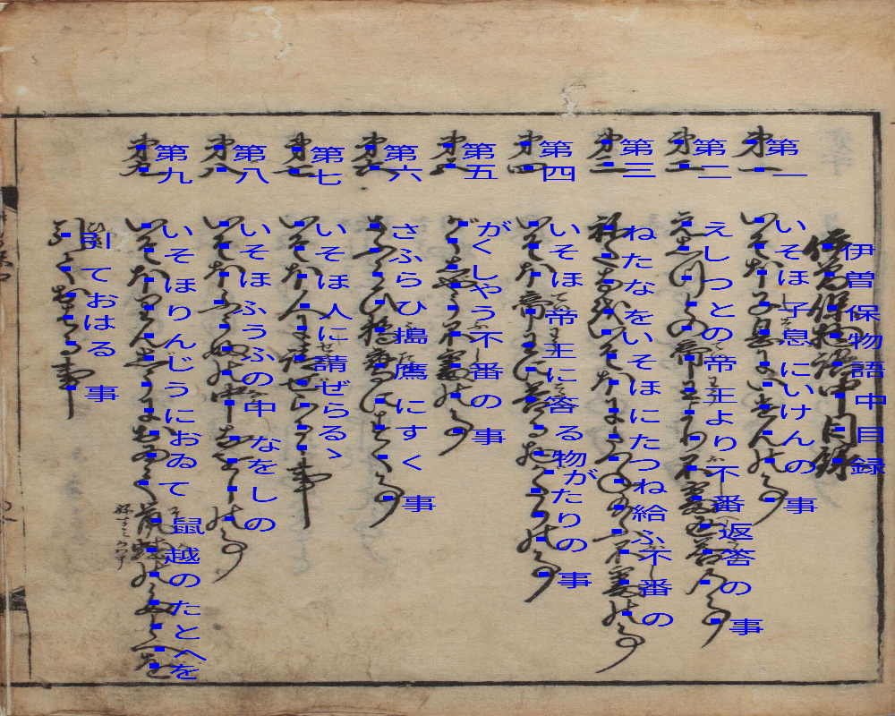
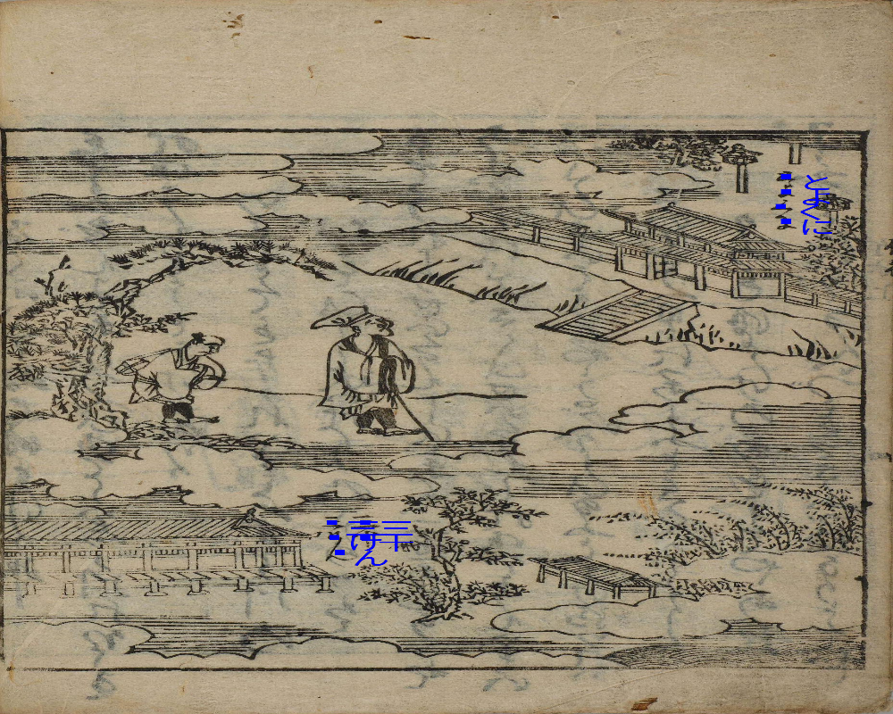

# Overview

Code for the [Kaggle Kuzushiji Recognition Challenge](https://www.kaggle.com/c/siim-acr-pneumothorax-segmentation). My team finished as 5th with a [F1-score](https://www.kaggle.com/c/kuzushiji-recognition/overview/evaluation) of `0.94`. The challenge was to develop better algorithms for Kuzushiji recognition.

<p align="center"> 
  
</p>

# Setup
The training data can be downloaded from here:
https://www.kaggle.com/c/kuzushiji-recognition/data

or using the Kaggle API:
```console
kaggle competitions download -c kuzushiji-recognition
```

Requirements:
```console
pip install --upgrade tqdm opencv-python==3.4.5.20 timm --user
pip install --upgrade git+https://github.com/albu/albumentations --user
```

Install `apex` for your system setup as explained here: https://github.com/NVIDIA/apex
This is optional if you just want to run inference.

```console
$ ls | grep images
>>> test_images
>>> train_images
```

# Training
```console
$ python train.py
```

This will produce the weights `Logdir_038_f00/f00-ep-0125-val_hm_acc-0.9944-val_classes_acc-0.4986.pth`. Training takes ~8 hours on a single V100 GPU with mixed precision training. Alternatively, the weights can be downloaded from [here](https://github.com/see--/kuzushiji-recognition/releases/download/v0.1/f00-ep-0125-val_hm_acc-0.9944-val_classes_acc-0.4986.pth). Just put them into `Logdir_038_f00`.


# Submission
```console
$ python submit.py
```

This will produce the submission file `Logdir_038_f00/f00-TTA-V7-PREDS-p0.40-.csv`.


# Visualization
You can visualize the predictions via: `python vis_submission.py --fn ../Kuzushiji/Logdir_038_f00/f00-TTA-V7-PREDS-p0.40-.csv`.

<p align="center"> 
  
</p>